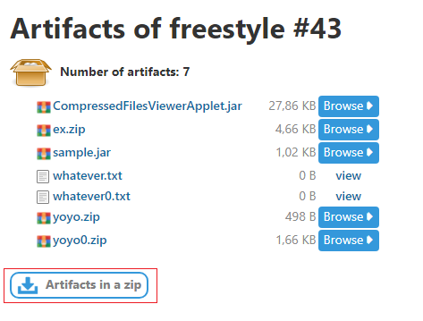
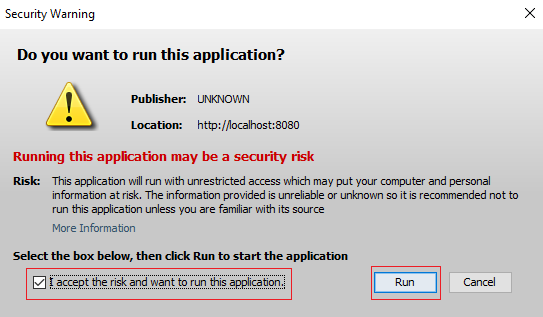
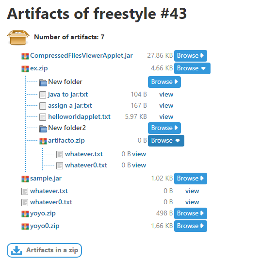

# compressed_files_viewer

## Introduction

This Jenkins plugin allows you to view compressed files in the artifacts list. The decompression process is performed on the client-side for less labor on the server.

## Requirements
 - Java 8 or lower(for applets support)
 - <a href="https://chrome.google.com/webstore/detail/ie-tab/hehijbfgiekmjfkfjpbkbammjbdenadd">IE Tab extension</a>

## Set up the applet
<ol>
  <li>Put/upload CompressedFilesViewerApplet.jar and add its url in codebase attribute inside <applet> tag in artifactList.jelly under src\main\resources directory.</li>
  <li>Go to control panel, open Java --> Security, and check this:</li>
</ol>
<br/>


## How to use
<table style="width:100%">
  <tr>
    <th>Select artifacts</th>
    <th>Tap the plugin button</th>
  </tr>
  <tr>
    <td></td>
    <td></td>
  </tr>
  <tr>
    <th>Download artifacts in a zip</th>
    <th>Reload this page with IE rendering to run the applet</th>
  </tr>
  <tr>
    <td></td>
    <td></td>
  </tr>
  <tr>
    <th>Grant access to applet to extract downloaded archive</th>
    <th>A message after applet work</th>
  </tr>
  <tr>
    <td></td>
    <td></td>
  </tr>
  <tr>
    <th>Close the IE rendering</th>
    <th>Now you can browse compressed files</th>
  </tr>
  <tr>
    <td></td>
    <td></td>
  </tr>
</table>

## Contributing

Refer to [contribution guidelines](https://github.com/jenkinsci/.github/blob/master/CONTRIBUTING.md)

## License
```
MIT License

Copyright (c) 2021 Ahmed Sellami

Permission is hereby granted, free of charge, to any person obtaining a copy
of this software and associated documentation files (the "Software"), to deal
in the Software without restriction, including without limitation the rights
to use, copy, modify, merge, publish, distribute, sublicense, and/or sell
copies of the Software, and to permit persons to whom the Software is
furnished to do so, subject to the following conditions:

The above copyright notice and this permission notice shall be included in all
copies or substantial portions of the Software.

THE SOFTWARE IS PROVIDED "AS IS", WITHOUT WARRANTY OF ANY KIND, EXPRESS OR
IMPLIED, INCLUDING BUT NOT LIMITED TO THE WARRANTIES OF MERCHANTABILITY,
FITNESS FOR A PARTICULAR PURPOSE AND NONINFRINGEMENT. IN NO EVENT SHALL THE
AUTHORS OR COPYRIGHT HOLDERS BE LIABLE FOR ANY CLAIM, DAMAGES OR OTHER
LIABILITY, WHETHER IN AN ACTION OF CONTRACT, TORT OR OTHERWISE, ARISING FROM,
OUT OF OR IN CONNECTION WITH THE SOFTWARE OR THE USE OR OTHER DEALINGS IN THE
SOFTWARE.
```
